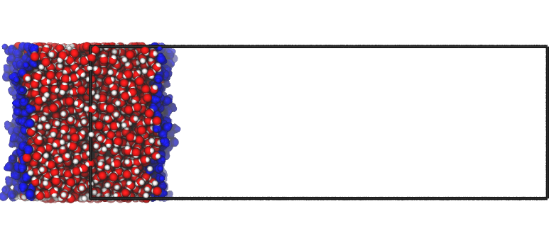
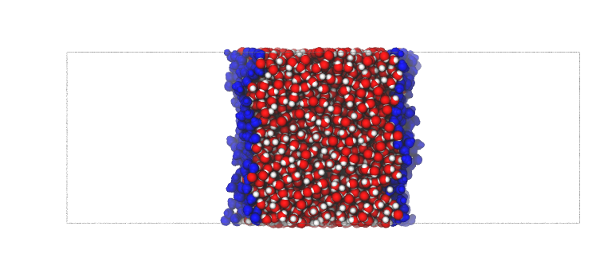

To center or not to center?
***************************

Summary
-------
:doc:`Pytim <quick>` provides different ways to center the interface in the simulation box, and how to compute profiles.

This short tutorial shows the different behaviors.

Example: pdb output for a planar interface
------------------------------------------

**Initial file**

The waterbox example file :file:`WATER_GRO` consists of 4000 water molecules, with all
atoms in the unit cell, and the liquid phase crossing the periodic boundary conditions:

.. image:: centering1.png
   :width: 35%
   :align: center

If you want to save a local copy of the file, you just need to use this code fragment:

.. code-block:: python

    import MDAnalysis as mda
    import pytim
    u         = mda.Universe(pytim.datafiles.WATER_GRO)
    u.atoms.write('centering1.pdb')

When initializing/computing the interface, :doc:`Pytim <quick>` internally centers the interface in different ways, depending whether :class:`~pytim.itim.ITIM` or :class:`~pytim.gitim.GITIM` is used. When the configuration with the surface layers information is written to file using :meth:`~pytim.itim.writepdb`, the system can be shifted so that the liquid phase is placed at different positions.

**Default, no centering**

If the (default) option :py:obj:`centered='no'` is used, then all atomic positions are kept the same as in the input file.
This is like the initial case, however with information on the surface molecules added to the pdb.

.. code-block:: python

    interface = pytim.ITIM(u)
    interface.writepdb('centering2.pdb',centered='no')

.. image:: centering3.png
   :width: 35%
   :align: center

**Centering at the origin**

The system can be shifted so that the liquid phase is placed across the origin of the normal axis, using the option :py:obj:`centered=origin`.
This comes handy to quickly discriminate between upper and lower surface atoms, to spot immediately the middle of the liquid phase, or to verify that the automatic centering method behaved as expected.

.. code-block:: python

    interface = pytim.ITIM(u)
    interface.writepdb('centering3.pdb',centered='origin')

**Centering in the middle**

If the option :py:obj:`centered='middle'` is passed  to :meth:`~pytim.itim.ITIM.writepdb`, instead, then the liquid part of the system is placed in the middle of the box along the surface normal:

.. code-block:: python

    interface.writepdb('centering4.pdb',centered='middle')

....

.. toctree::

.. raw:: html
   :file: analytics.html

