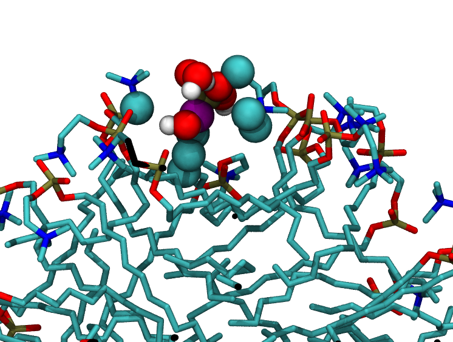

.. -*- Mode: python; tab-width: 4; indent-tabs-mode:nil; coding: utf-8 -*-
.. vim: tabstop=4 expandtab shiftwidth=4 softtabstop=4

Surface of a micelle
********************

Summary
-------
We use the :class:`~pytim.gitim.GITIM` class to investigate the surface composition of a DPC micelle

This tutorial shows how to do some basic statistical analysis and how to visualize
surface atoms / pockets for water.

The DPC micelle
---------------

The micelle example file :file:`MICELLE_PDB` consists of 65 DPC and 6305 water molecules,
for a total of about 20,000 atoms (D. P. Tieleman, D. van der Spoel, H.J.C.
Berendsen, J. Phys. Chem. B 104, pp. 6380-6388, 2000)

.. image:: micelle1.png
   :width: 35%
   :align: center

As this is not a planar interface, we will use the GITIM class to identify the atoms at the
surface of the micelle. Our reference group for the surface analysis includes therefore
all DPC molecules

    >>> import numpy as np
    >>> import MDAnalysis as mda
    >>> import pytim
    >>> from   pytim.datafiles import *
    >>> #
    >>> # this is a DPC micelle in water
    >>> u = mda.Universe(MICELLE_PDB)
    >>> #
    >>> # select all lipid molecues
    >>> g = u.select_atoms('resname DPC')

In order to calculate the surface atoms, we invoke :class:`~pytim.gitim.GITIM`, passing
the group `g` as the `group` option, and set `molecular=False` in order to mark
only the atoms at the surface, and not the whole residues to which these atoms belong.

    >>> # calculate the atoms at the interface ...
    >>> inter = pytim.GITIM(u,group=g,molecular=False,alpha=2.5)
    >>> #
    >>> # ... and write a pdb file (default:'layers.pdb') with layer information in the beta field
    >>> inter.writepdb()

The micelle with its surface atoms highlighted in purple looks like this (left: from outside; right: section through the middle)

+------------------------+------------------------+
|.. image:: micelle3.png |.. image:: micelle2.png |
|   :width: 70%          |   :width: 70%          |
|   :align: right        |   :align: left         |
+------------------------+------------------------+

Some statistics
---------------

It's easy to calculate some simple statistical properties. For example, the percentage of atoms of DPC at the surface is

    >>> print "percentage of atoms at the surface: {:.1f}".format(len(inter.layers[0])*100./len(g))
    percentage of atoms at the surface: 37.4

This is a rather high percentage, but is due to the small size of the micelle (large surface/volume ratio)

We can also easily find out which atom is more likely to be found at the surface:

    >>> # we cycle over the names of atoms in the first residue
    >>> for name in g.residues[0].atoms.names :
    ...     total   = np.sum(g.names==name)
    ...     surface = np.sum(inter.layers[0].names == name )
    ...     print('{:>4s} ---> {:>2.0f}%'.format(name, surface*100./total))
      C1 ---> 86%
      C2 ---> 57%
      C3 ---> 75%
      N4 --->  0%
      C5 ---> 69%
      C6 ---> 88%
      O7 ---> 60%
      P8 --->  0%
      O9 ---> 72%
     O10 ---> 82%
     O11 ---> 49%
     C12 ---> 34%
     C13 ---> 38%
     C14 ---> 12%
     C15 ---> 23%
     C16 --->  9%
     C17 ---> 17%
     C18 ---> 11%
     C19 ---> 18%
     C20 ---> 11%
     C21 ---> 14%
     C22 ---> 17%
     C23 ---> 17%

One immediately notices that P and N are never (or almost never) at the surface: this is because they are always buried wihin their bonded neighbors in the headgroup.
Also, a non negligible part of the fatty tails are also found from time to time at the surface.

Close inspection
----------------

One might wonder how accurately surface atoms are detected. In principle, looking at close distance, one could find some atoms that look to be below the surface, but are marked as interfacial ones. In the next figure, surface atoms are depicted with spheres, non-surface atoms with sticks, and the suspicious atom (an oxygen) in purple.

.. image:: micelle4.png
   :width: 35%
   :align: center

We check now all DPC atoms that are within a radius of 0.4 nm (that is, the radius of oxygen, 0.15 nm, plus the radius of the probe sphere, 0.25 nm)
There is in fact a pocket opening between the camera and our purple oxygen, althouth it is still not clear from the picture

.. image:: micelle5.png
   :width: 35%
   :align: center

If we include also the water molecules that are within the 0.4 nm radius, it becomes immediately clear that the purple oxygen is a surface one as, in fact,
water molecules have entered the pocket:

So, the :class:`~pytim.gitim.GITIM` algorithm is in fact spotting correctly surface atoms.

....

.. toctree::

.. raw:: html
   :file: analytics.html

