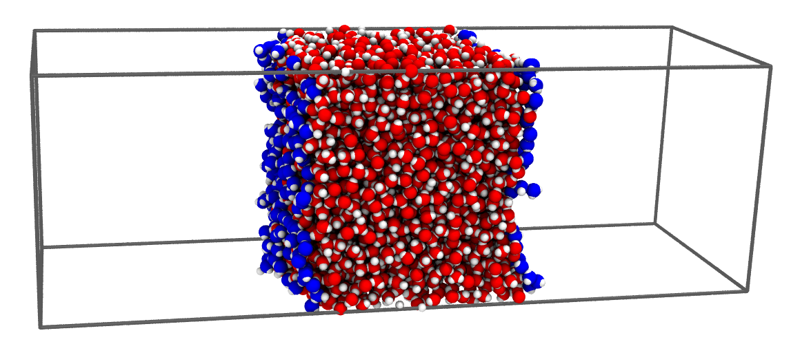

Pytim: Quick Tour
*****************

Pytim is a package based on MDAnalysis_ for the identification and analysis of surface molecules in configuration files or in trajectories from molecular dynamics simulations.

.. _MDAnalysis: http://www.mdanalysis.org/
.. _Supported_Formats: https://pythonhosted.org/MDAnalysis/documentation_pages/coordinates/init.html#id1

Basic Example
=============

This is a basic example that shows how easy is to use the :class:`~pytim.itim.ITIM` class
for planar interfaces:

.. code-block:: python

    import MDAnalysis as mda                 
    import pytim 
    from   pytim.datafiles import *

    # load an example configuration file
    u         = mda.Universe(WATER_GRO)

    # initialize the interface
    interface = pytim.ITIM(u)

    # write a pdb with the information on the surface layers
    interface.writepdb('layers.pdb')

    # access the atoms in the layers as an MDAnalysis' AtomGroups
    upper_layer = interface.layers('upper')

The above lines are doing the following:

1. Import the modules of MDAanalysis, pytim, and some example datafiles,
   then initialize the MDAnalysis universe in the usual way, using
   as an input file one of the structures provided by the package, in
   this case a water/vapor interface in a gromos file format (the
   variable WATER_GRO is made available by the pytim.datafiles module)
2. The interfacial analysis is then initialized using the
   :class:`~pytim.itim.ITIM` class, and the molecular layers are
   calculated automatically.
3. The whole configuration is saved to a pdb for graphical inspection using
   :meth:`~pytim.itim.ITIM.writepdb`
   (with surface atoms having a beta factor equal to the numer of the layer 
   they belong to).
4. The groups of atoms corresponding to different layers can be extracted using
   :meth:`~pytim.itim.ITIM.layers`

The result of the calculation can be seen in the following picture,
where surface oxygen atoms are highlighted in blue.

This is a very basic example, and many more are given in the :doc:`Tutorials`. 

Pytim's Main Features
=====================

* It's easy to use! While many optional arguments can be used to trigger special features, 
  or to fine-tune the behavior of the algorithm, just invoking the class with the minimal
  set of arguments, as in the example shown here, delivers what you expect.

* Works for planar (:mod:`~pytim.itim`)  and arbitrary (:mod:`~pytim.gitim`) interfaces

* Thanks to MDAnalysis_, Pytim can work with several common file formats, including: 

  - CHARMM & NAMD,
  - LAMMPS
  - GROMACS
  - AMBER 
  - DL_POLY
  - GAMESS 

  For the full list see the Supported_Formats_

* It's *fast!* The planar interface identification, as well as the clustering analysis to filter the vapor or diluted phases both scale in theory, in the average case, like O(N log N). In practice, sublinear scaling is observed for systems up to 10,000 atoms, and ~ O(N^1.3) up to 100,000 atoms, on an 1,7 GHz Intel Core i7. The surface identification for a system of 10,000 atoms, for example, requires only 0.2 s on this hardware.

* It comes with several analysis tools, specifically written for the properties of the interfacial atoms, such as

  - in-layer radial distribution functions
  - intrinsic and non-intrinsic density profiles
  - calculation of surface triangulation and associated geometrical parameters 
  - ... 

* It is easy to extend: as it relies on the MDAnalysis_ interface,
  it is easy to modify the core classes and/or to add new observables

....

.. toctree::

.. raw:: html
   :file: analytics.html

